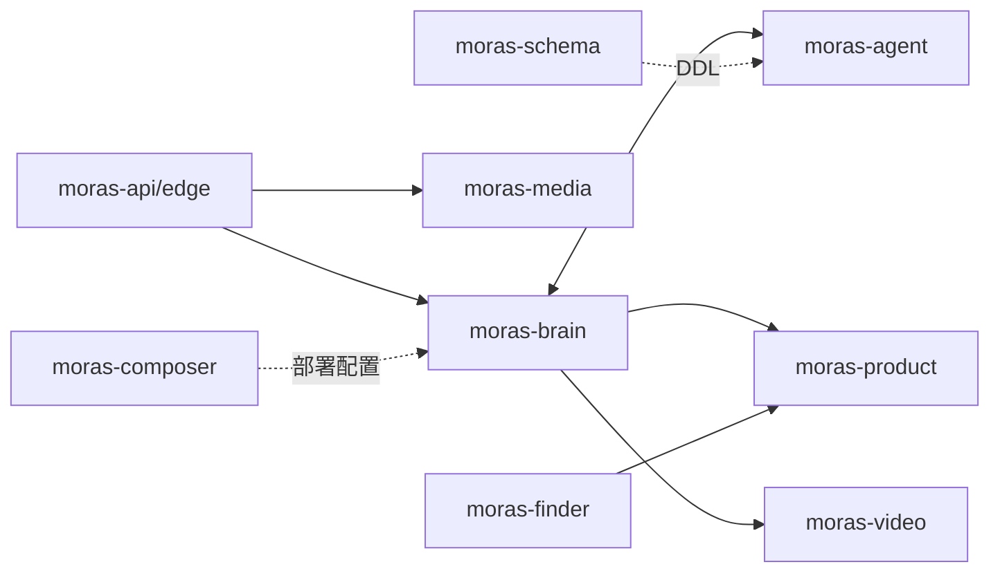

# 2026-09-08

## 今日目标

在一台新电脑上接入公司私有 Gitea，拉取 MORAS 核心项目，并建立对系统功能、架构和调用链的初步认识。

## 完成的任务

### 私有仓库访问

- 打开 `git.k2lab.ai`，通过公司内网 OAuth2 账号登录。
- 进入 Gitea Key 设置页面，检查新电脑的仓库访问准备。
- 执行 `xcode-select --install`，安装 macOS Command Line Tools。
- 验证私有仓库可以被本机读取和克隆。

### 第一批仓库

拉取到 `/Users/zhao/Documents/Workspace/`：

- `moras-brain`
- `moras-agent`
- `moras-api`

对三个项目进行初步分析：

- `moras-brain`：Multi-Agent 推理和工具调度运行时。
- `moras-agent`：Agent 会话、任务、产物和运行数据服务。
- `moras-api`：面向产品用户的 Node.js AI 视频后端。

### 核心依赖仓库

从调用关系继续拉取：

- `moras-edge`
- `moras-product`
- `moras-video`
- `moras-media`
- `moras-schema`
- `moras-composer`

随后补充：

- `moras-finder`

### 专题分析

- 分析本地仓库的技术栈和选型合理性。
- 深入研究 `moras-brain` 的 Multi-Agent 方案，并用视频生产解释 Agent 协作。
- 查看 `moras-finder` 的采集、评分、跨库同步与 Meilisearch 数据链路。
- 查看 `moras-composer` 的目录结构及配置注入方式。

## 当日形成的系统认识

- Brain 负责决策和推理。
- Agent 负责持久状态、版本、恢复和审计。
- Finder/Product 负责商品数据和推荐。
- Video/Media 负责异步媒体生成与处理。
- Schema/Composer 负责数据结构和运行环境。

## 结果

- 新电脑已具备访问公司私有代码的基础能力。
- MORAS 核心仓库已形成完整本地工作集。
- 明确后续应选择单一项目做全生命周期学习，而不是一次启动全部服务。

## 关联

- [[01-MORAS系统全景与调用链]]
- [[02-MORAS仓库职责与技术栈]]
- [[03-moras-brain的Multi-Agent与视频生产]]
- [[05-moras-composer与moras-finder专题]]
