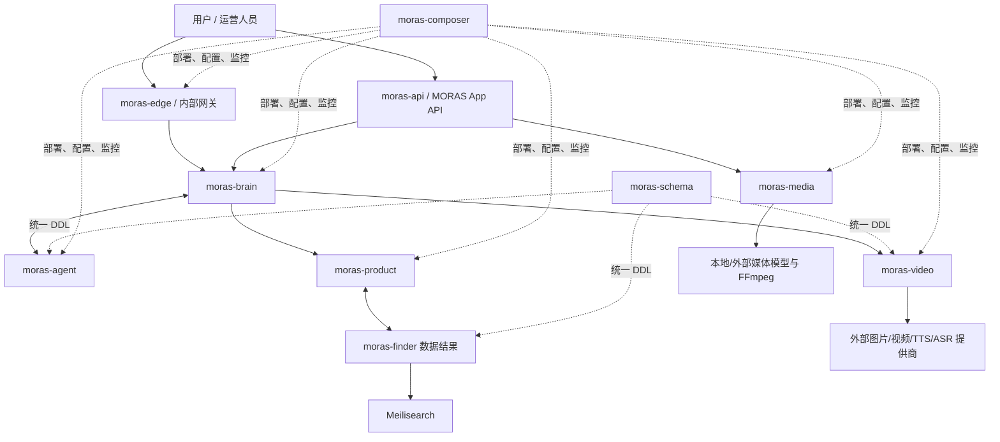
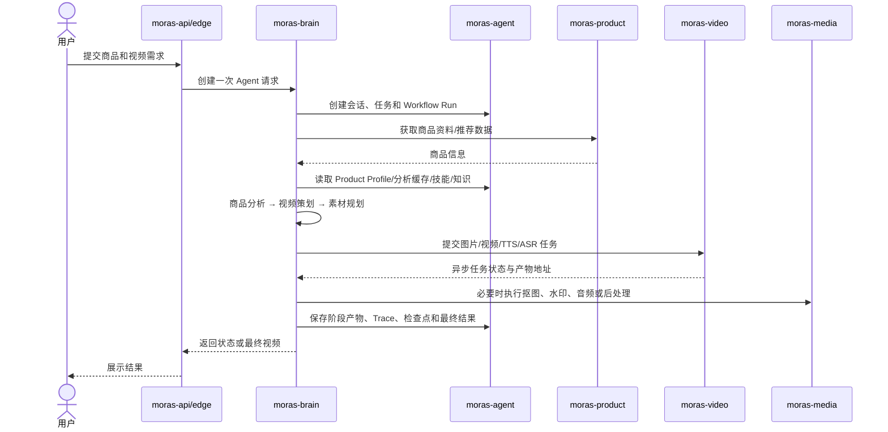

# MORAS 系统全景与调用链

## 业务分层

## 各层的产品职责

### 入口与身份层

- `moras-api`：面向产品用户的 Node.js 后端，承担 JWT、用户、文件、任务以及图片/视频能力的统一产品 API。
- `moras-edge`：内部平台网关，处理 Keeper OAuth、角色校验、CORS 和服务反向代理；它也会根据 `moras-agent` 的 Agent 注册表决定未知 Agent slug 是否允许进入 Brain Pool。

### 智能决策层

- `moras-brain`：加载 Agent Profile，选择模型，组织上下文，调用工具，并在 Multi-Agent 模式下委派子任务。
- 它是“思考和调度”的主要位置，不应把持久化细节散落回 Brain 内部。

### 运行状态与治理层

- `moras-agent`：拥有 `ai_agents` 和 `ai_journal`，保存会话、消息、任务、工作流运行、Agent 产物、Trace、技能、知识和运行配置。
- 它解决的是一致性、审计、恢复、版本和生命周期管理问题。

### 商品与选品层

- `moras-finder`：从 FastMoss 等来源采集商品，进行趋势和内容评分，同步到业务库与 Meilisearch。
- `moras-product`：提供商品检索、推荐及内部商品 API，消费 Finder 整理后的商品数据和搜索索引。

### 媒体执行层

- `moras-video`：异步图片、视频、TTS、ASR、工作流和 FFmpeg Job 的服务端执行器，使用 RabbitMQ 和数据库做持久化队列与恢复。
- `moras-media`：视频抠像、商品图抠图、音色转换、字幕、水印、相似度等媒体模型和后处理管线。

### 平台工程层

- `moras-schema`：所有数据库 Schema 和 Migration 的统一管理入口。
- `moras-composer`：Docker Compose、Helm、Argo CD Application、Secret、监控和告警配置的基础设施仓库。

## 以视频生产为例的主链路

## 关键边界

1. **推理与持久化分离**：Brain 负责决策，Agent 负责状态和事实。
2. **媒体生成与业务编排分离**：Video/Media 执行昂贵、异步的媒体工作，Brain 决定何时调用。
3. **DDL 与运行代码分离**：Schema 变更先进入 `moras-schema`，运行服务只消费结构。
4. **外部入口与内部服务分离**：`moras-agent` 不应直接暴露给终端用户，通常经 Edge/API 进入。
5. **环境声明与业务代码分离**：镜像版本、环境变量和 Secret 引用由 Composer/Helm/Argo CD 管理。

## 进一步阅读

- [[02-MORAS仓库职责与技术栈]]
- [[03-moras-brain的Multi-Agent与视频生产]]
- [[04-moras-agent产品能力与架构]]
