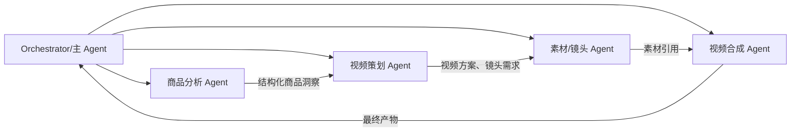

# moras-brain 的 Multi-Agent 与视频生产

## 产品定位

`moras-brain` 是 MORAS 的 Multi-Agent 运行时。它对外提供聊天/执行入口，加载 `profiles/<agent-slug>/` 下的身份、规则、知识、技能与工具配置，并把用户目标拆给合适的 Agent 或工具。

它与 [[04-moras-agent产品能力与架构|moras-agent]] 的区别是：

- Brain 决定“下一步做什么”。
- Agent 服务记录“发生了什么、结果是什么、以后如何恢复”。

## Profile 驱动的 Agent

一个 Agent 可以理解为五部分：

1. **Identity**：它是谁、面向什么目标。
2. **Rules**：约束、决策原则和输出要求。
3. **Knowledge**：业务知识与可复用上下文。
4. **Skills**：在特定触发条件下使用的流程能力。
5. **Toolsets**：能够调用的外部系统或子 Agent。

运行时既可以使用磁盘中的 Profile 基线，也可以从 `moras-agent` 读取已发布的在线覆盖配置。这样既保留代码审查和版本控制，也支持经过审核的热更新。

## Multi-Agent 的协作方式

主 Agent 的价值不是亲自完成所有工作，而是：

- 判断任务需要哪些能力；
- 为子 Agent 准备上下文；
- 记录父子任务关系；
- 收集结构化产物；
- 根据结果决定继续、重试、降级或结束。

## 视频生产示例

假设用户提出“为一个 TikTok 商品生成短视频”：

1. **商品理解**：读取 Product Profile、商品图片、类目和已有分析，形成卖点、受众和风险提示。
2. **视频策划**：选择表现形式，产生 Hook、叙事结构、镜头表和配音文案。
3. **素材生成**：调用 `moras-video` 生成图片、视频片段、TTS 或 ASR 任务。
4. **媒体处理**：必要时调用 `moras-media` 做抠图、抠像、水印、音色或字幕处理。
5. **合成**：Composer 阶段根据策划和素材形成最终视频。
6. **持久化**：每个阶段的任务、Trace、产物、错误和版本写入 `moras-agent`。
7. **反馈学习**：用户反馈和人工 QA 进入学习链路，形成 Knowledge 或 Learned Skill 候选。

## 为什么要拆成多个 Agent

- 每个 Agent 的提示词和工具集更聚焦，减少单一上下文过长。
- 中间结果可以独立审核、缓存和复用。
- 某个阶段失败时只重跑局部，避免整条昂贵链路重做。
- 可以针对不同阶段使用不同模型和成本策略。
- Trace 能准确定位质量问题属于商品理解、策划、素材还是合成。

## 需要关注的产品风险

- 子 Agent 越多，协调成本和失败点越多，拆分必须对应真实的专业边界。
- 中间产物必须结构化并有版本，否则下游很难稳定消费。
- 重试必须有幂等键、任务状态和产物引用，否则会造成重复生成与重复计费。
- 在线技能和 Profile 覆盖要经过发布生命周期，不能让自动学习直接改变生产行为。

## 相关笔记

- [[01-MORAS系统全景与调用链]]
- [[04-moras-agent产品能力与架构]]
