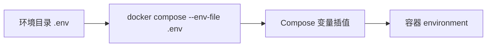
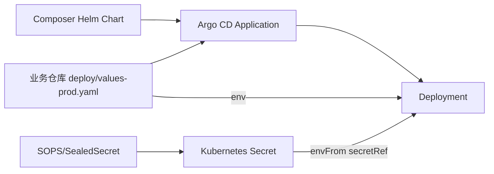
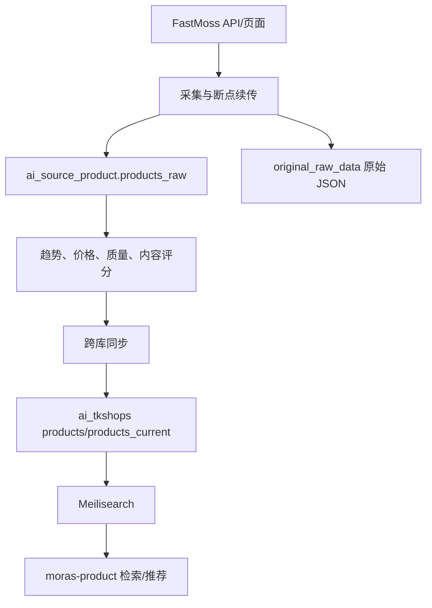

# moras-composer 与 moras-finder 专题

## moras-composer：平台部署与配置控制仓库

`moras-composer` 不生成业务内容，它负责描述“服务以什么镜像、什么配置、在什么环境中运行”。仓库包含：

- 本地、测试、生产的 Docker Compose 编排；
- 各服务 Helm Chart；
- Argo CD Application；
- Nginx、证书和基础设施配置；
- SOPS 加密源 Secret 与 SealedSecret；
- Prometheus/Grafana 监控和告警；
- Gitea Runner 与 CI/CD 辅助脚本。

### 配置如何注入业务服务

#### Docker Compose 路径

`local/.env`、`test/.env` 或 `prod/.env` 提供环境值；脚本在对应环境目录执行 `docker compose --env-file .env`。Compose 文件通过 `${VAR}` 将值写入容器环境变量。`COMPOSE_FILE` 可以组合共享定义、环境覆盖和镜像覆盖。

本地模式主要启动 MySQL、Redis、RabbitMQ、Meilisearch、Qdrant 等基础设施，业务服务推荐从源码运行。

#### Kubernetes/Argo CD 路径

以 `moras-agent` 为例：

- Chart 在 `moras-composer/charts/moras-agent-chart`。
- Argo CD 同时读取 Composer 的 Chart 和 `moras-agent/deploy/values-prod.yaml`。
- 非敏感配置通过 Helm `.Values.env` 渲染成容器 `env`。
- 数据库密码、内部 Key 等通过 `envFrom.secretRef` 引入 `moras-agent-secret`。
- 应用本身只从环境变量读取配置，不需要知道 Secret 如何生成。

这是一种“配置声明在平台仓库，环境覆盖在业务仓库，敏感值进入 Secret”的注入方式。

## moras-finder：TikTok Shop 选品数据中台

`moras-finder` 的核心目标是把外部商品原始数据加工成可检索、可排序和可推荐的数据。

### 核心能力

- 通过 FastMoss 采集 TikTok Shop 商品与相关数据；部分 Agent 节点使用 Playwright。
- 保留原始 JSON，便于审计和重新加工。
- 基于 7 天趋势、多维质量和内容特征计算等级与评分。
- 工作流支持断点恢复、单步重跑、重置和定时执行。
- 将加工结果同步到 `ai_tkshops` 和 Meilisearch。
- 提供 Web 页面做筛选、排序、分页和导出。

### 数据库边界

- `ai_source_product`：采集源数据、原始归档、采集目标、评分配置和 Workflow Run。
- `ai_tkshops`：产品化后的商品、当前快照、类目销量、视频等业务数据。
- DDL 已统一交给 `moras-schema`，Finder 不应继续维护一套重复 Migration。

### 它与其他服务的关系

- Finder 决定“哪些商品值得被看到，以及商品数据怎样进入业务库”。
- Product 决定“面对具体用户或场景，怎样检索和排序商品”。
- Brain 可以把商品信息作为商品分析与视频策划的输入。
- Agent 服务保存面向生成链路的 Product Profile、分析缓存和 Agent 产物。

## 两个项目的共同特点

这两个仓库都处于业务主链路之外，却决定主链路是否可靠：

- Finder 决定输入数据质量。
- Composer 决定服务实际运行时得到什么配置和基础设施。
