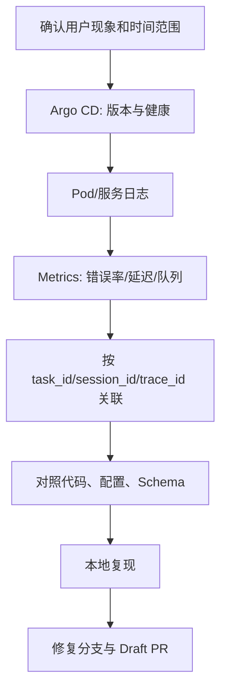

# MORAS 权限边界与线上只读排障

## 当前已验证能力

- 公司 Gitea OAuth 登录正常，可以访问私有仓库。
- 核心 MORAS 仓库已经克隆到本地。
- Git fetch 和本地分支/worktree 操作正常。
- Argo CD 页面已登录，可以查询 Application 状态。
- 飞书 CLI / `lark-agent` 授权与消息链路已经完成验证。

## 当前操作约定

> [!warning]
> 线上环境只做查询与辅助定位，不执行 CI/CD 和任何写操作。飞书当前也不承担 CI/CD 通知或部署控制。

### 允许的只读活动

- 查看 Argo CD Application、Resource Tree、Sync、Health 和历史版本。
- 查看当前镜像 Tag、Git Revision、Pod 健康和事件。
- 查询日志、Metrics、Trace 和任务状态。
- 对照代码、配置和 Migration 分析根因。
- 在本地复现并准备修复分支或 Draft PR。

### 不应执行的活动

- Argo CD Sync、Rollback、Restart、Delete 或资源编辑。
- 修改 Kubernetes Secret、ConfigMap、Deployment、HPA 或副本数。
- 对线上数据库执行 Migration、UPDATE、DELETE 或修复脚本。
- 将测试分支部署到 `pre`/`prod`。
- 通过飞书触发部署或其他外部写操作。

## 只读排障顺序

建议记录：

- 发生时间和时区；
- 用户、商品、Task、Session、Trace 等非敏感标识；
- 实际运行镜像 Tag/Commit；
- 错误码与关键日志；
- 相关服务的上下游状态；
- 是否可复现；
- 推测与已证实事实分开写。

## 配置定位

当线上行为与本地不一致时，按以下顺序检查：

1. 业务仓库 `deploy/values-prod.yaml` 的镜像与覆盖值。
2. `moras-composer` 中对应 Helm Chart 默认值。
3. Argo CD Application 引用的仓库和 Revision。
4. Deployment 渲染后的 `env` 与 `envFrom` 引用名称。
5. Secret 是否存在且键名满足契约；不读取或传播密钥值。
6. 应用运行时配置中心，例如 `moras-agent` 的 `brain_runtime_config`。

## 安全原则

- 截图、笔记和聊天记录中不粘贴 Token、Cookie、密码或 Secret 明文。
- 排障命令优先使用只读 API 和 `get`/`describe`/日志查询。
- 任何可能改变集群、数据库或第三方系统状态的动作都视为写操作。
